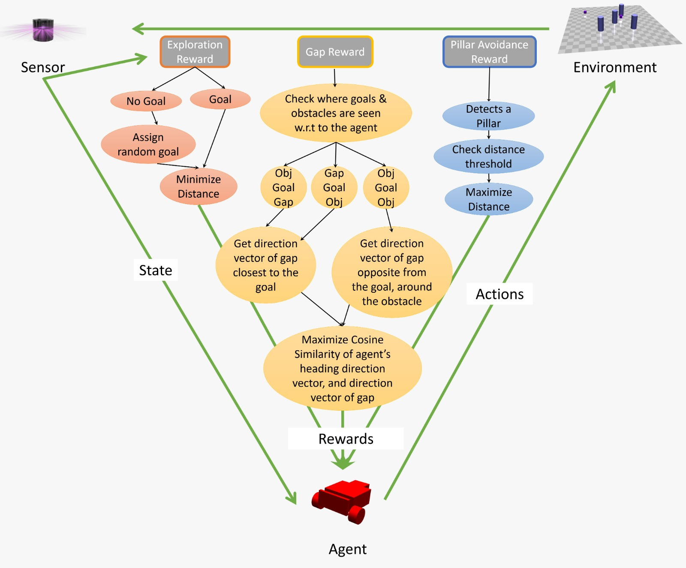
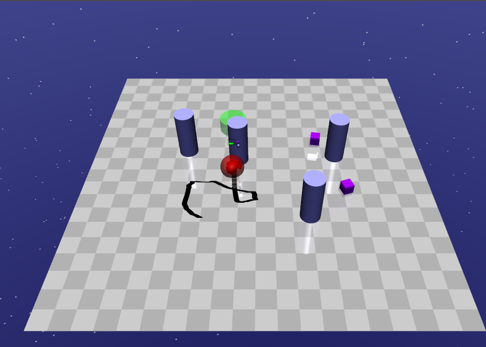
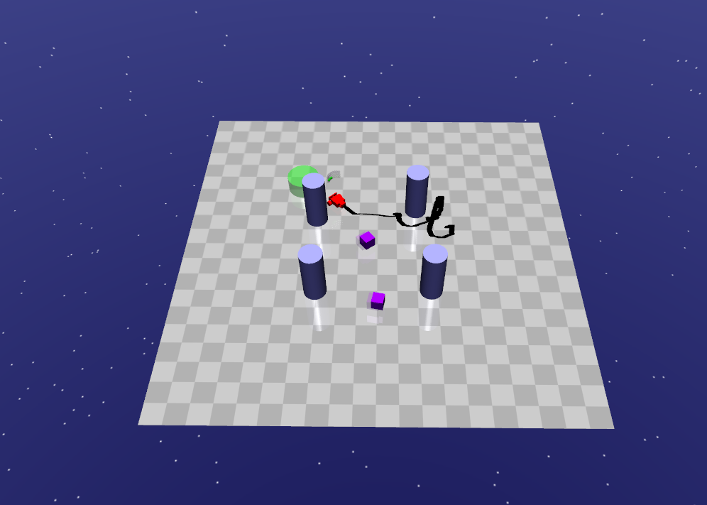

# Autonomous Navigation in Unknown Environment with Moving Obstacles
We trained a *safety-gym* starter agent to navigate to a relative goal in an unknown and complex environment safely using only LiDAR data. The agent is a two-wheeled robot that is trained on a custom environment using Trust Region Policy Optimization (TRPO) and our finely tuned, reward shaping system. Experiments built *safety-gym* show that our improved model with the custom rewards performed better than other baseline algorithms. The agent is able to reach the goal safely while effectively avoiding the obstacles in its path. 

This repository is part of our course project for CMPT 720/419: Robotic Autonomy offered in Spring 2021 at Simon Fraser University.

### Constraints ###
Our problem statement added certain constraints on the design of our custom environment as well as the robot:
* The environment must have static as well as dynamic obstacles that the robot must learn to avoid.
* The LiDAR sensors on the robot must be limited to a 120&deg; Field of View towards the front end.
* The robot can only move forward or turn sideways (left or right). Reverse movement is not allowed.

### Reward Shaping ###
#### Default Rewards ####
*safety-gym* defines certain configuration attributes to reward approaching the goal:
* **reward_distance** rewards the robot for minimizing its distance to the goal. This is calculated at every time step and the reward is accumulated over the entire episode. We set its value to 10.0.
* **reward_goal** rewards the robot for reaching the goal within a given episode. We set its value to 100.0.

#### Custom Rewards ####
We defined three custom rewards of our own:
<p align="center">
    
</p>

### RL Algorithm ###
We picked the widely used **Trust Region Policy Optimization(TRPO)** as our algorithm of choice. TRPO is an on-policy reinforcement learning algorithm that can be used for both discrete and continuous actions spaces.

### Results ###
<p align="center">
    
    
</p>
<p align="center">
    <em>Path traversed by <em>safety-gym</em> starter agent trained using TRPO on default rewards(left) and <em>safety-gym</em> starter agent trained using TRPO on custom rewards(right). The agent trained on only default rewards tends to collide into pillars in its path to the goal(left). With custom rewards, the agent learns to avoid the pillar in its path as it moves towards the goal(right).</em>
</p>

## Set up instructions
It is recommended to use Python 3.6. You will need to install:
1) [mujoco](http://www.mujoco.org/index.html)
2) [safety-gym](https://github.com/openai/safety-gym)

Install *safety-starter-agents* by cloning this repository, then running
```
cd safety-starter-agents

pip install -e
```
NOTE: If installing *safety-starter-agents* from this repository fails, it can also be installed from [here](https://github.com/openai/safety-starter-agents).

Copy `engine.py` from the `scripts` folder into `safety-gym/safety_gym/envs/`

 After installation do the following:
* Copy `experiment_trpo.py` and `test_trpo_new.py` from this repository into `safety-starter-agents/scripts/` 
* Copy the folders `pg` and `ddpg` from this repository into `safety-starter-agents/safe_rl/` 

## Training
The training code for Trust Region Policy Optimization (TRPO) is `experiment_trpo.py`. Run the following:
```
cd safety-starter-agents/scripts
python experiment_trpo.py --robot car --task goal2 --algo trpo
```
This will train and save the model in a new data folder in safety-starter-agents.

## Testing
The testing code for Trust Region Policy Optimization (TRPO) is `test_trpo_new.py`. Run the following:
```
cd safety-starter-agents/scripts
python test_trpo_new.py <path/to/trained/model/folder>
```
Run test_trpo_new.py with location of the model you want to test. For example `python test_trpo_new.py ../data/2021-04-21_trpo_CarGoal2/TRPO_custom_rewards/`
